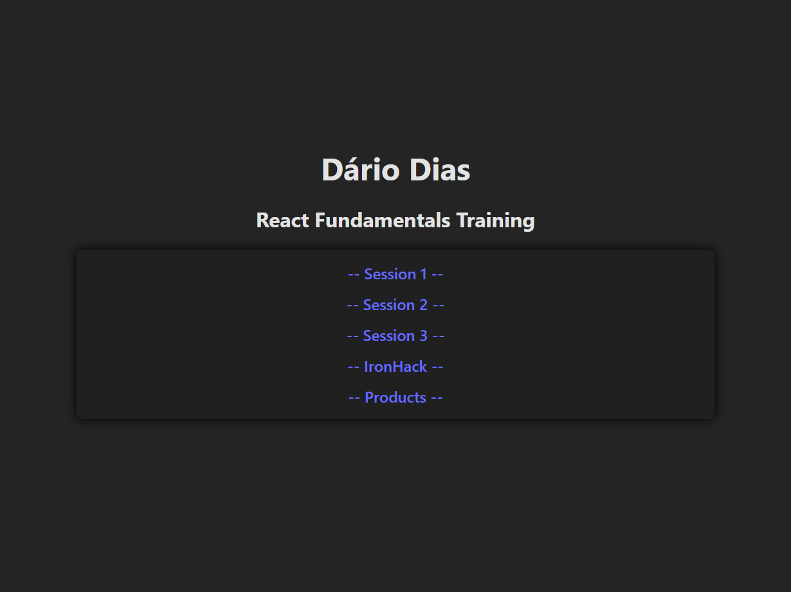
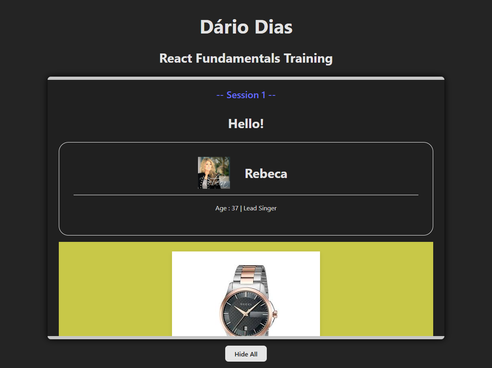
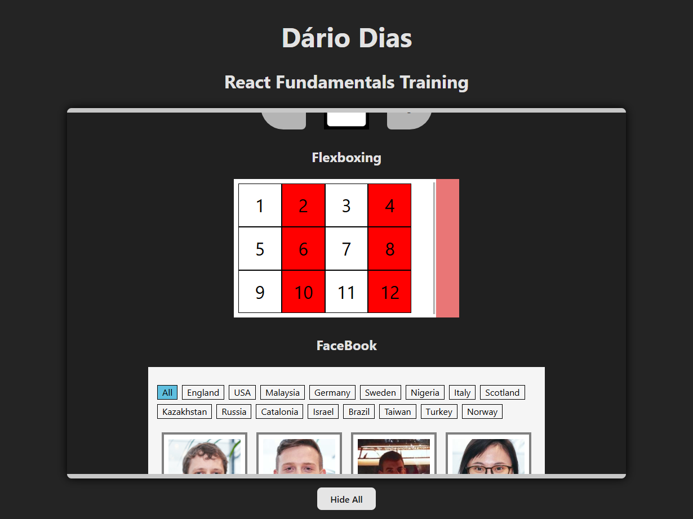
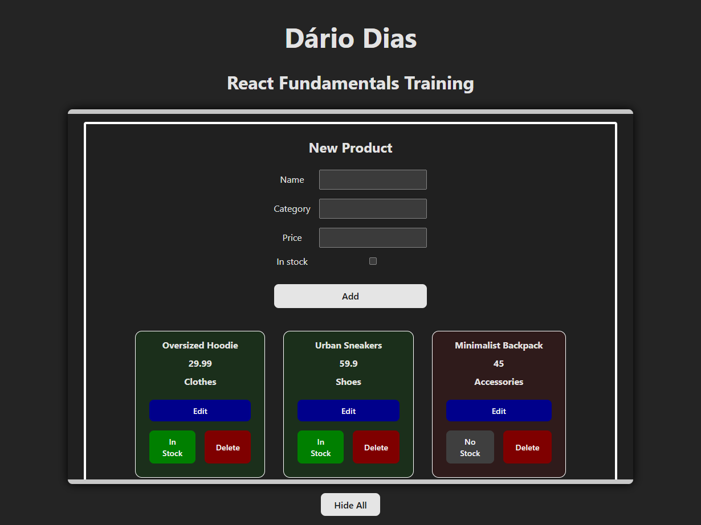
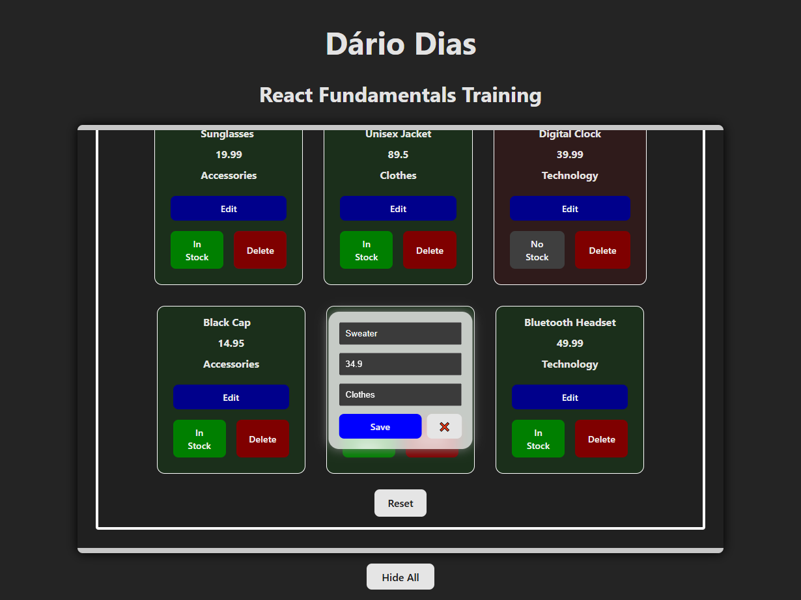
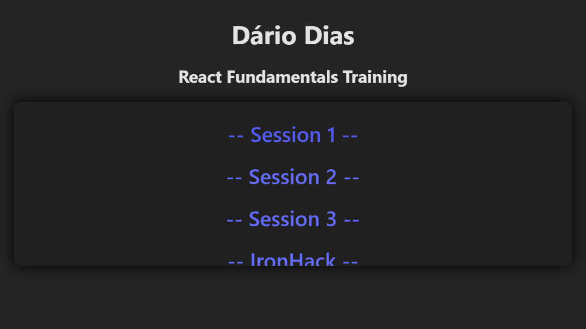

# My First React

A small React project made of all exercises done in a training course on React Fundamentals. The exercises progress in complexity, culminating in a more complete feature: a small **product management interface** with browser storage.

After the course was finished, I tweaked a few things to make the app more presentable.

## Live Demo
https://my-first-react-dario-97-d.netlify.app/

---

## 🎯 Project Main Goals

### Introduction to React

* Componentization
* JSX syntax
* Hooks
* Basic CRUD

---

## 🛍  Product List Exercise (basic CRUD)

Features:

* Product list display
* Product component rendering
* Forms for creating and editing Products
* Products state

---

## 🧑 Post-course improvements

* Local storage data persistence
* Interactive Flexbox display
* Animated and Responsive app layout
* Custom hook [useAdaptiveLayout](src/utils/useAdaptiveLayout.js)

---

## 📂 Project Structure

Example structure of the project:

```
public
 ├─ images/country-flags
src
 ├─ assets
 ├─ components
 │   ├─ IronHack
 │   ├─ products
 │   ├─ session1
 │   ├─ session2
 │   ├─ session3
 │   │
 │   ├─ IronHack.jsx
 │   ├─ Products.jsx
 │   ├─ Session1.jsx
 │   ├─ Session2.jsx
 │   └─ Session3.jsx
 │
 ├─ data
 │   ├─ berlin.json
 │   └─ products.json
 │
 ├─ utils
 │   ├─ debounce.js
 │   └─ useAdaptiveLayout.js
 │
 ├─ AnimatedSection.jsx
 ├─ App.css
 ├─ App.jsx
 ├─ index.css
 └─ main.jsx
```

## 📸 Screenshots

### Start View



### Accordion Open



### Resizable Flexbox



### Products CRUD



### Edit Product



### Scaled down Header on mobile


